# [Summon](https://devpost.com/software/summon)

A voice-activated AI companion that lives on your screen as a 3D animated character. Built in 36 hours at HackPrinceton 2025.

Talk to it. It watches your screen, listens to you, and talks back.

---

## What it does

Summon is a floating macOS overlay app. A 3D robot sits on top of whatever you're working on. When you speak, it hears you. It can also see your screen via OCR and use that context to respond intelligently. Responses are spoken back using ElevenLabs voice synthesis with a glow effect that pulses when it talks.

Three modes:
- **Reactive** — only responds when you speak to it
- **Proactive** — chimes in on its own based on what you're doing
- **Hybrid** — both

---

## Tech stack

| Layer | Technology |
|---|---|
| Language | Swift |
| Rendering | Metal + ModelIO (custom PBR shader pipeline) |
| 3D Model | USDZ (Poddy robot) |
| Window | Transparent always-on-top overlay (AppKit) |
| Voice input | Apple Speech framework |
| Voice output | ElevenLabs API |
| AI brain | Claude API |
| Screen context | ScreenCaptureKit + Vision (OCR) |

---

## Architecture

```
                    ┌─────────────────────────┐
                    │  VoiceCompanionCoordinator │
                    └────────────┬────────────┘
           ┌──────────┬──────────┼──────────┬──────────┐
           ▼          ▼          ▼          ▼          ▼
    SpeechRecognizer  ClaudeAPI  ElevenLabs  ScreenCapture  ModelRenderer
    (STT)             (brain)    (TTS)       (OCR context)  (Metal/GPU)
```

---

## Setup

Clone the repo and open `Summon.xcodeproj`.

Add your API keys to `Summon/Config.swift` (copy from `Config.example.swift`):

```swift
static let claudeAPIKey     = "YOUR_CLAUDE_API_KEY"
static let elevenLabsAPIKey = "YOUR_ELEVENLABS_API_KEY"
static let elevenLabsVoiceID = "YOUR_VOICE_ID"
```

Required permissions (granted at first launch):
- Microphone — voice input
- Screen Recording — OCR context

---

## The build journey

I wanted to dive deep into a graphical api during my first hackton. Overall the project did not come easy. But Here's what 36 hours of debugging looked like.

### 2:32 PM — The model

Started with a Black Cat USDZ asset previewed in Blender. The plan was to render it as a transparent overlay using a custom Metal pipeline.

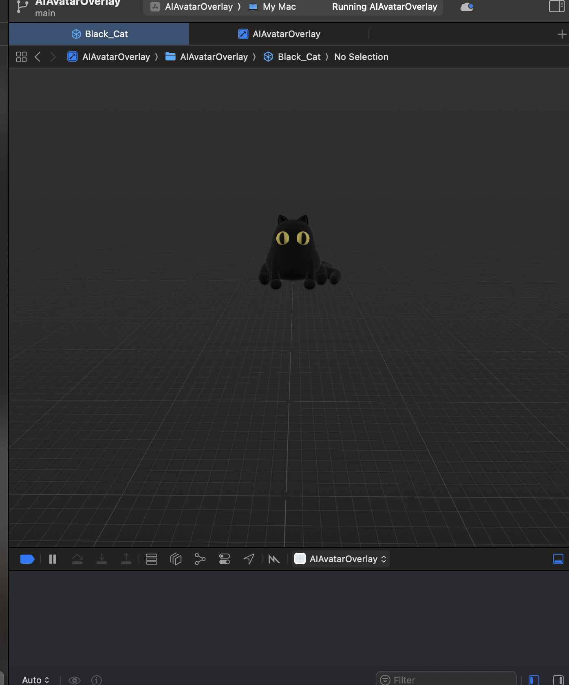

---

### 4:00 PM — Xcode setup

Got the project scaffolded. AppKit window, Metal view, ModelIO for loading USDZ. Added the frameworks: AppKit, MetalKit, ModelIO.

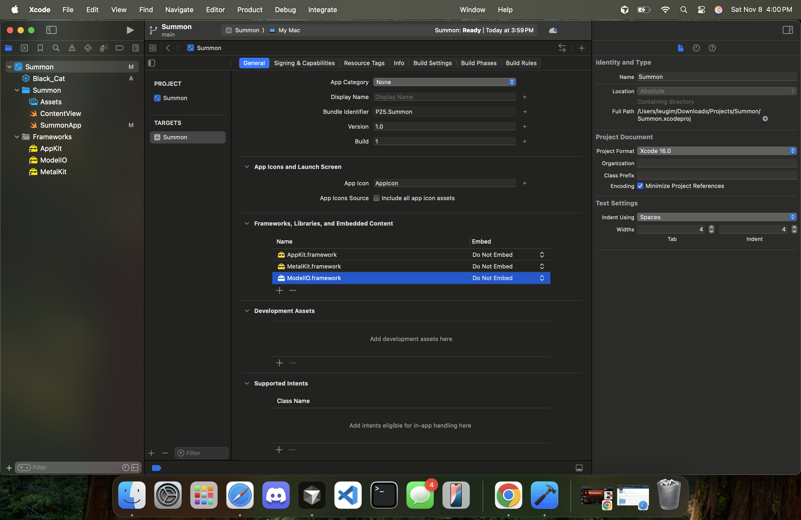

---

### 5:00 PM — First crash

First run. Immediately hit `Message from debugger: killed` inside the Metal draw loop. The render pipeline wasn't set up correctly before the first draw call — force unwrapping a nil pipeline state.

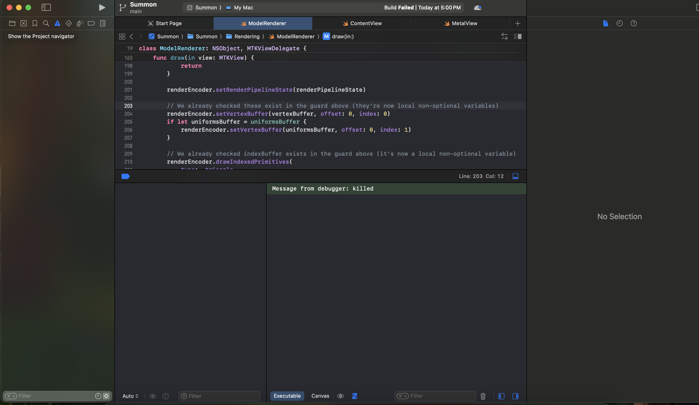

---

### 5:04 PM — It runs. Nothing shows.

App launches, window is transparent, no crash. Completely blank. Metal is drawing nothing. At this point it's unclear if the window is transparent or just empty.

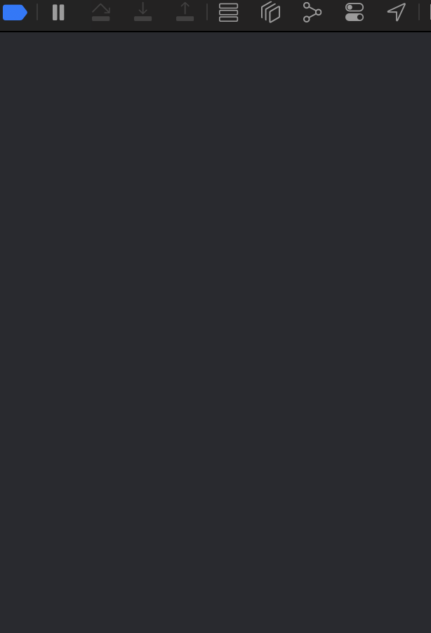

---

### 8:25 PM — Textures are broken

Got the model loading and rendering. But the textures are completely wrong — bright green background, black geometry, white blowout where the albedo should be. PBR texture extraction from the USDZ zip is failing silently and falling back to defaults.

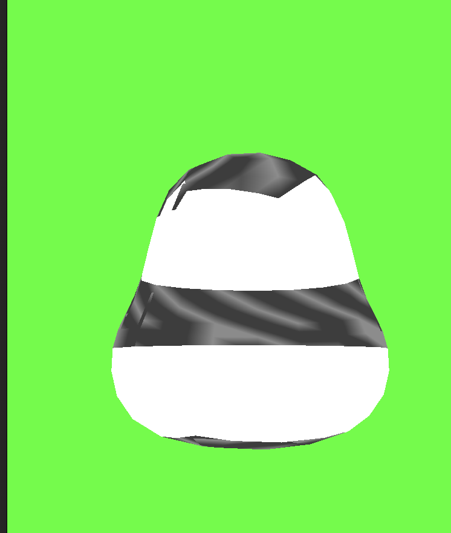

---

### 8:44 PM — Deep in the debugger

Several hours of console logs, Cursor AI, and frustration. The model loads (229 vertices, 1344 indices, bounding box computed), but the texture coordinates are wrong and the cat is "broken." Switched strategy — drop the cat, use the Poddy robot model instead which has cleaner geometry.

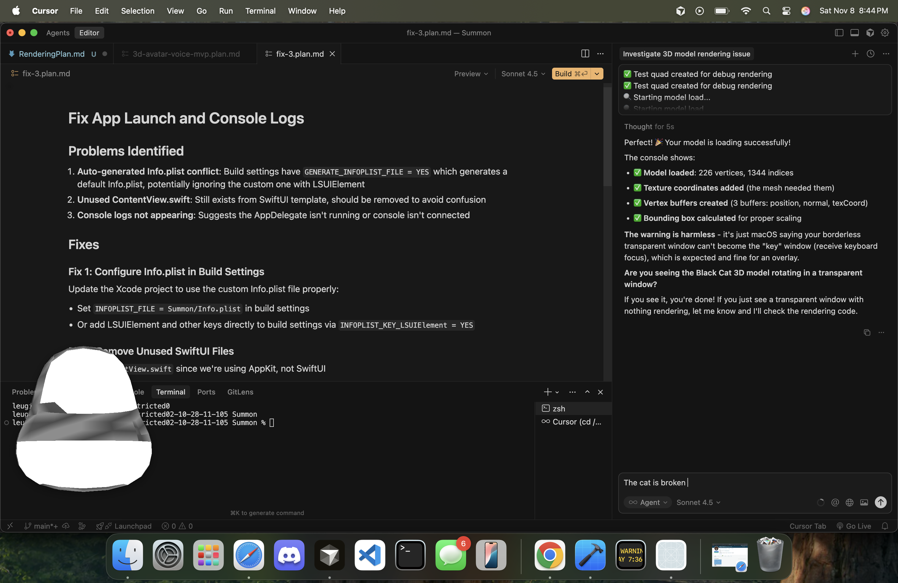

---

### 10:09 PM — What it's supposed to look like

This is Poddy rendered correctly in a standard viewer. Green eyes, metallic body, clean PBR. This is the target.

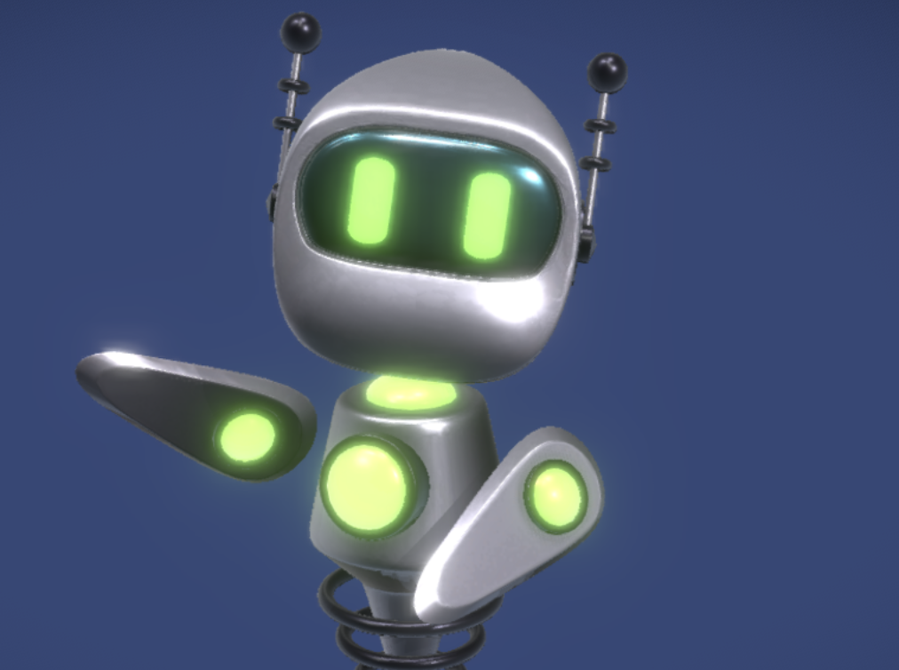

---

### 10:16 PM — Not that.

First attempt at rendering Poddy through the custom Metal pipeline. Geometry is exploded. UV coordinates are mapping the entire texture atlas to individual triangles. Normal maps are making it look like a crumpled foil ball.

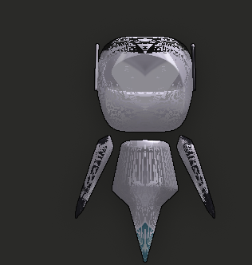

---

### 10:24 PM — Going back to basics

Ripped out the model loader and drew a single triangle to verify the Metal pipeline itself works. It does. The problem is in mesh extraction and buffer layout from ModelIO.

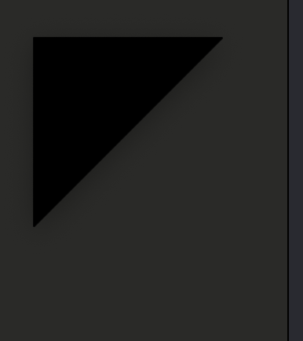

---

### 10:43 PM — At least the API credits work

Took a break to grab the ElevenLabs promo code from an MLH coach. $25 in voice synthesis credits. The robot will talk eventually.

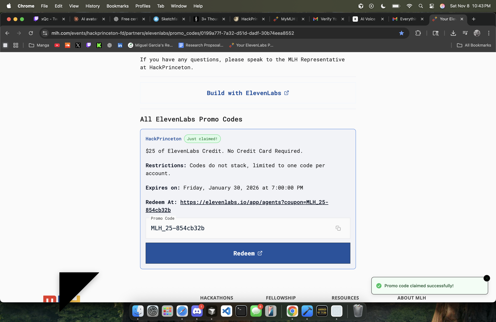

---

### 11:49 PM — Making progress

Fixed the vertex descriptor layout — was using the wrong attribute offsets for the ModelIO mesh. Model is rendering now but PBR isn't working, everything is dark with no specular response.

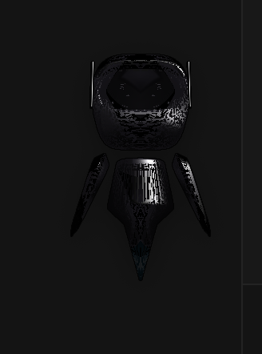

---

### 12:02 AM — Clean preview in ModelIO

Confirmed the USDZ file itself is fine by loading it in a standard MDLAsset preview. The geometry and textures are all there. The issue is entirely in how the Metal shader reads the material properties.

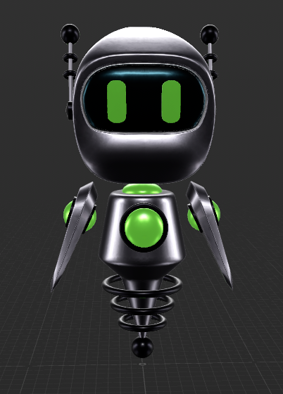

---

### 2:19 AM — Lighting pass

Got the PBR shader partially working. Ambient and diffuse are there, specular is blowing out. The model is recognizable for the first time.

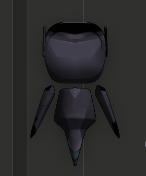

---

### 2:31 AM — Almost

Tuned the metallic/roughness values. The robot has proper shading now. The face, body, and legs are reading correctly. Just needs the green eye glow to pulse on speech.

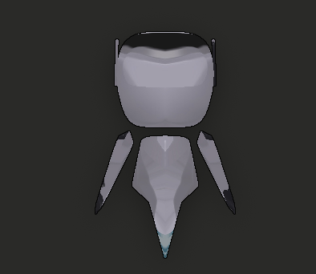

---

### 2:36 AM — Done.

The final result is an unskinned model rendered in real-time through a custom 3D rendering engine built on Apple Metal. Tied the glow intensity to the isSpeaking state so the eyes pulse when it talks. Wired up Claude + ElevenLabs. It works.
The finally result is an unskined model which 
---

Built at HackPrinceton 2025 by Miguel Garcia.
